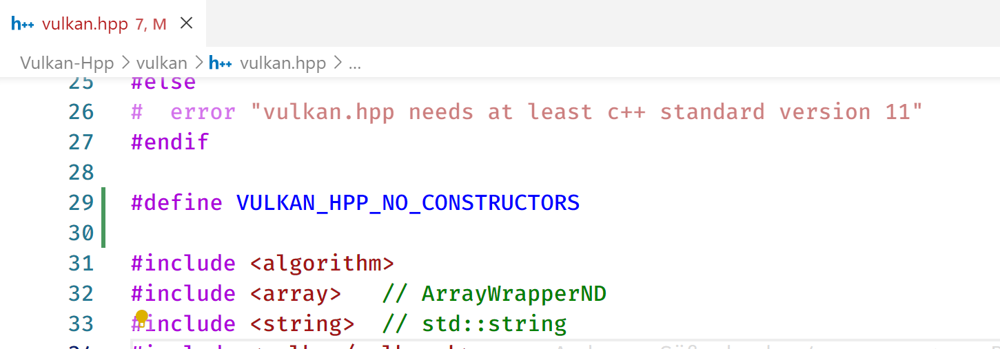

## vulkan-cpp23

A.cpp contains an example of cpp23.

### 如何复现这个编译错误

How to reproduce this compilation error

env:
> windows 11
> 
> vs 17.7.0 preview 2.0
> 
> cmake 3.26
> 
> vulkan sdk 1.3.243

download & build:

- download and install vulkan sdk
- pull this repo
- add `#define VULKAN_HPP_NO_CONSTRUCTORS` in the front of `Vulkan-Hpp\vulkan\vulkan.hpp`
  
- build:
```
git clone --recurse-submodules https://github.com/dashuai009/Vulkan-cpp23.git Vulkan-cpp23
cd Vulkan-cpp23
cmake -S . -B build -G "Visual Studio 17 2022"
cmake --build build --target vulkan-cpp23-A --config Debug -j 24
```

error:
```
Scanning sources for module dependencies...
A.cpp
C:\Users\15258\work\vulkan-cpp23\A.cpp(49,1): fatal  error C1001: Internal compiler error.
(compiler file 'msc1.cpp', line 1628)
 To work around this problem, try simplifying or changing the program near the locations listed above.
If possible please provide a repro here: https://developercommunity.visualstudio.com
Please choose the Technical Support command on the Visual C++
 Help menu, or open the Technical Support help file for more information
INTERNAL COMPILER ERROR in 'C:\Program Files\Microsoft Visual Studio\2022\Preview\VC\Tools\MSVC\14.37.32705\bin\HostX64\x64\CL.exe'
    Please choose the Technical Support command on the Visual C++
    Help menu, or open the Technical Support help file for more information
Done building project "vulkan-cpp23-A.vcxproj" -- FAILED.
```
